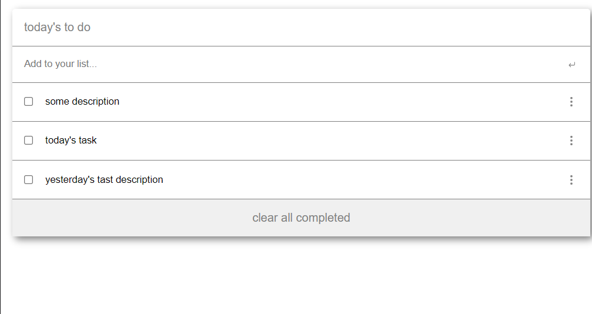

# To Do List

> An easy way to create a list of things to do in the day



Webpack used to load components and modules to the project.

## Built With

- HTMl, CSS, JavaScript
- Webpack

## Live Demo

[Live Demo Link](https://maccrazyman.github.io/to-do-list/dist/)


## Getting Started

To get a local copy up and running follow these simple example steps.

### Prerequisites
* A functional computer with VS Code or any functional coding software.
* Git bash or any version control software.

### Setup
* Copy the repo link and clone it in your local machine
* You can execute the following command in your git bash:
    ```` 
    git clone https://github.com/MacCrazyman/to-do-list.git
    ````

### Usage
* Open the [index](./index.html) file with your browser to see the webpage.
* You can also open the [GitHub pages deployment](https://maccrazyman.github.io/to-do-list/dist/) to see a live version of the webpage.


## Authors

👤 **Leonardo Pareja**

- GitHub: [@MacCrazyman](https://github.com/MacCrazyman)
- Twitter: [@MacCrazyman](https://twitter.com/MacCrazyman)
- LinkedIn: [Leonardo Pareja](https://www.linkedin.com/in/leonardo-pareja-pareja/)


## 🤝 Contributing

Contributions, issues, and feature requests are welcome!

Feel free to check the [issues page](../../issues/).

## Show your support

Give a ⭐️ if you like this project!


## 📝 License

This project is [MIT](./LICENSE) licensed.
